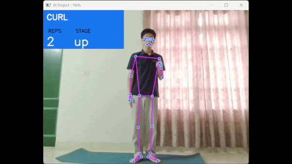
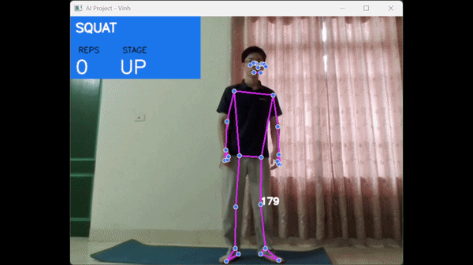
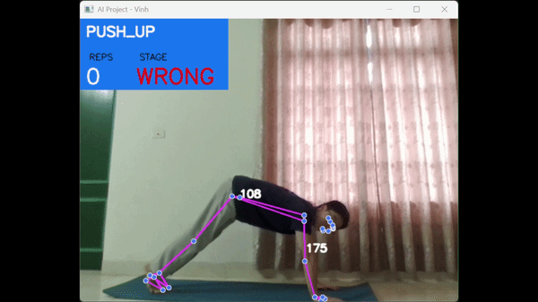

# AI Personal Trainer 🏋️‍♂️

**AI Personal Trainer** là một ứng dụng hỗ trợ tập luyện thể thao được xây dựng bằng **Python**, **OpenCV**, và **MediaPipe**. Dự án này sử dụng công nghệ nhận diện tư thế (Pose Estimation) thông qua 33 điểm mốc trên cơ thể để phân tích chuyển động, đếm số nhịp tập và cung cấp phản hồi trực quan theo thời gian thực.

## Tính năng nổi bật 🌟

### Các chức năng chính:
- **Nhận diện tư thế thời gian thực**: Theo dõi và vẽ các khớp xương, góc chuyển động trực tiếp trên màn hình camera.
- **Phản hồi trực quan (UI)**: Bảng thông tin hiển thị rõ ràng số nhịp (REPS) và trạng thái hiện tại (STAGE).
- **Cảnh báo sai tư thế**: Tự động nhận diện và đổi màu cảnh báo nếu người dùng tập sai kỹ thuật (ví dụ: nâng hông quá cao khi hít đất).

### Các chế độ bài tập (Modes):
1. **Bicep Curl (Gập tay)**:
   - Theo dõi góc khuỷu tay để xác định trạng thái nâng/hạ tạ.
   - Đếm số nhịp chính xác dựa trên biên độ co duỗi.
2. **Squat (Ngồi xổm)**:
   - Phân tích góc tạo bởi hông, đầu gối và gót chân.
   - Giúp người tập kiểm soát độ sâu của tư thế squat.
3. **Push-Up (Hít đất)**:
   - Tính toán khoảng cách từ tay đến mặt đất để xác định tư thế chuẩn bị.
   - Theo dõi cả góc khuỷu tay và góc hông.
   - Cảnh báo trạng thái **"WRONG"** (Sai) nếu hông bị võng hoặc không thẳng hàng với cơ thể.

## Công nghệ sử dụng 🛠️

- **Python**: Ngôn ngữ lập trình cốt lõi.
- **OpenCV (`opencv-python`)**: Xử lý hình ảnh, hiển thị giao diện đồ họa và tích hợp luồng video từ camera.
- **MediaPipe (`mediapipe`)**: Cung cấp mô hình học máy để nhận diện và theo dõi 33 điểm mốc trên cơ thể người.
- **NumPy (`numpy`)**: Xử lý mảng dữ liệu và tính toán các góc hình học phức tạp giữa các khớp xương.

## Hướng dẫn cài đặt và sử dụng 🚀

### Yêu cầu hệ thống:
- Trình biên dịch Python 3.8 trở lên.
- Có webcam kết nối với máy tính.

### Các bước cài đặt:
1. Clone kho lưu trữ này về máy của bạn:
   ```bash
   git clone https://github.com/vinlee15/AI_Personal_Trainer
   ```
2. Cài đặt các thư viện phụ thuộc:
   ```bash
   pip install -r requirements.txt
   ```
3. Chạy ứng dụng
   ```bash
   python main.py
   ```
4. Cách sử dụng:
  - Khi chạy file, terminal sẽ yêu cầu bạn nhập chế độ tập. Hãy gõ một trong các từ khóa sau: CURL, SQUAT, hoặc PUSH_UP.

  - Đứng vào khung hình camera và bắt đầu tập luyện.

  - Nhấn phím q trên bàn phím để thoát ứng dụng.

## Hình ảnh thực tế 📸

Đây là kết quả sau khi tôi đã thử nghiệm tất cả các chức năng của trò chơi. Video đầy đủ:(https://drive.google.com/drive/folders/1GdF0oksnfjWFIbAAlIHTu1C6W1SIQHqK)
  - Chế độ Bicep Curl:


  - Chế độ Squat:


  - Chế độ Push-up:


## Hướng phát triển trong tương lai 🚧
- **Áp dụng Supervised Learning (Học có giám sát) để phân tích kỹ thuật**: 
  - Thay vì sử dụng các ngưỡng góc cố định, dự án sẽ tiến tới việc thu thập dữ liệu (video động tác tập đúng và sai).
  - Tiến hành gán nhãn dữ liệu và trích xuất đặc trưng từ tọa độ 33 điểm mốc của MediaPipe.
  - Huấn luyện các mô hình máy học (như SVM, Random Forest, hoặc Mạng nơ-ron nhân tạo) để hệ thống tự động phân loại, nhận diện và chỉ ra chính xác lỗi sai của người tập theo thời gian thực.

- Thêm các bài tập như Deadlift, Pull-up, hoặc Jumping Jacks.

- Tích hợp giao diện Menu đồ họa (GUI) để chọn bài tập trực tiếp trên màn hình thay vì nhập qua Terminal.

- Thêm âm thanh thông báo (ví dụ: tiếng "Bíp" khi đếm được 1 rep hoặc cảnh báo bằng giọng nói khi sai tư thế).
 

